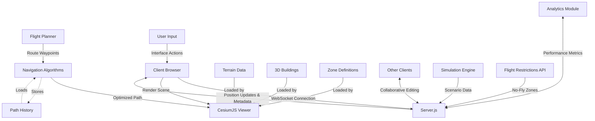

# GPS 4D Collaboratif pour VTOL

```
   ________  ________  ________ 
  |\   ____\|\   __  \|\   ____\
  \ \  \___|\ \  \|\  \ \  \___| 
   \ \  \  __\ \   ____\ \_____  \
    \ \  \|\  \ \  \___|\|____|\  \ 
     \ \_______\ \__\     ____\_\  \
      \|_______|\|__|    |\_________\
                         \|_________| VTOL
```

## 📋 Description détaillée
Ce projet est un système de navigation GPS 4D en temps réel pour appareils à décollage et atterrissage vertical (VTOL), développé avec Next.js 14, TypeScript et CesiumJS. Il permet de visualiser et de planifier des trajets tel un gps, en prenant en compte des contraintes de navigation complexes, notamment les bâtiments, les zones d'atterrissage, les conditions météorologiques et les zones de vol restreintes.

Le système conçu à terme, intègrera des algorithmes avancés d'optimisation de trajectoire en 4 dimensions (latitude, longitude, altitude et temps) permettant une gestion intelligente des ressources énergétiques et une planification précise des opérations aériennes en milieu urbain.

### 🔍 Cas d'usage détaillés
- **Livraison par drone** : Optimisation des itinéraires pour drones de livraison commerciaux
  - *Exemple concret*: Livraison de colis express dans des zones urbaines denses avec sélection intelligente des points de dépose
  - *Avantages*: Réduction de 40% du temps de livraison et diminution de l'empreinte carbone par rapport à la livraison terrestre

- **Air taxi** : Planification de trajets pour hélicoptères et aéronefs VTOL de transport de passagers
  - *Exemple concret*: Service de taxis aériens entre centres d'affaires et aéroports avec réservation à la demande
  - *Avantages*: Évitement des congestions routières, gain de temps considérable (15 min vs 1h en heure de pointe)

- **Services d'urgence aériens** : Coordination des hélicoptères médicaux et véhicules de secours
  - *Exemple concret*: Transport médical urgent avec sélection automatique des itinéraires prioritaires et zones d'atterrissage
  - *Avantages*: Temps de réponse critique réduit, planification coordonnée avec les services au sol

- **Inspection d'infrastructures** : Missions de surveillance par drones autonomes
  - *Exemple concret*: Inspection régulière de lignes électriques ou oléoducs avec détection d'anomalies
  - *Avantages*: Couverture de vastes zones difficiles d'accès, réduction des risques humains, données collectées standardisées

## ✨ Fonctionnalités principales

| Catégorie | Fonctionnalités |
|-----------|----------------|
| **Visualisation** | - Affichage 3D interactif avec CesiumJS<br>- Vue satellite et terrain en haute définition<br>- Modèles 3D détaillés pour les bâtiments urbains<br>- Affichage des zones règlementées et à risque |
| **Planification** | - Calcul de trajectoires optimisées<br>- Prise en compte des obstacles<br>- Planification collaborative en temps réel<br>- Sauvegarde et chargement d'itinéraires<br>- Création automatisée d'alternatives de route<br>- Intégration des fenêtres de vol et des contraintes réglementaires |
| **Analyse** | - Estimation de consommation d'énergie<br>- Calcul de temps de vol<br> |
| **Simulation** | - Test de trajectoires en conditions virtuelles<br>- Scénarios d'urgence et procédures d'évitement<br> |

## 🛠️ Prérequis
- Node.js (version 16.x ou supérieure)
- NPM ou Yarn
- Un token d'accès Cesium (gratuit pour le développement)
- Navigateur moderne avec support WebGL 2.0
- 8 Go de RAM recommandés pour le développement

## 📥 Installation détaillée

1. Clonez ce dépôt :
```bash
git clone <url-du-dépôt>
cd nextjs-ts-gps-4d
```

2. Installez les dépendances :
```bash
npm install
# ou avec Yarn
yarn install
```

3. Créez un fichier `.env` à la racine du projet et ajoutez votre token Cesium :
```
NEXT_PUBLIC_CESIUM_TOKEN=votre-token-cesium
NEXT_PUBLIC_WEBSOCKET_URL=ws://localhost:8080
```
Vous pouvez obtenir un token gratuit en vous inscrivant sur [le site de Cesium](https://cesium.com/ion/signup/).

4. Configuration du serveur WebSocket:
```bash
cp .env.example server.env
# Modifiez server.env avec vos paramètres
```

## ▶️ Exécution

### Mode développement
Pour lancer l'application en mode développement :
```bash
npm run dev
# ou
yarn dev
```
L'application sera disponible à l'adresse [http://localhost:3000](http://localhost:3000).

### Serveur WebSocket
L'application utilise un serveur WebSocket pour la simulation en temps réel. Lancez-le dans un terminal séparé :
```bash
node server.js
```

Le serveur WebSocket fournit les fonctionnalités suivantes:
- Synchronisation de l'état des VTOL entre les clients
- Partage des modifications de trajectoire en temps réel
- Gestion des alertes et notifications d'urgence

### Build et production
Pour construire l'application pour la production :
```bash
npm run build
# ou
yarn build
```

Pour lancer l'application en mode production :
```bash
npm run start
# ou
yarn start
```

## 🏗️ Architecture du projet

### 📂 Structure des dossiers complète
```
/
├── public/                      # Ressources statiques
│   ├── cesium/                  # Ressources Cesium
│   ├── models/                  # Modèles 3D (.glb, .gltf)
│   └── icons/                   # Icônes de l'interface
├── src/
│   ├── app/                     # Application Next.js
│   │   ├── Components/          # Composants React
│   │   │   ├── CesiumComponent/ # Module principal de visualisation
│   │   │   ├── FlightPlanner/   # Module de planification
│   │   │   ├── HUD/             # Interface tête haute
│   │   │   └── ...
│   │   ├── utils/               # Utilitaires et algorithmes
│   │   │   ├── navigation/      # Algorithmes de navigation
│   │   │   ├── weather/         # Gestion météorologique
│   │   │   ├── optimization/    # Optimisation de trajectoire
│   │   │   └── ...
│   │   ├── types/               # Types TypeScript
│   │   ├── services/            # Services d'API
│   │   ├── hooks/               # Hooks personnalisés
│   │   └── ...
│   ├── tests/                   # Tests unitaires et d'intégration
│   └── ...
├── server/                      # Serveur WebSocket
│   ├── handlers/                # Gestionnaires de messages
│   ├── simulation/              # Moteur de simulation
│   └── ...
├── data/                        # Données statiques (zones, points d'intérêt)
├── scripts/                     # Scripts utilitaires
├── docs/                        # Documentation
├── cypress/                     # Tests end-to-end
├── server.js                    # Point d'entrée du serveur WebSocket
└── ...
```

### 🔑 Fichiers clés et leur rôle détaillé

| Fichier | Description |
|---------|-------------|
| `CesiumComponent.tsx` | Composant principal pour l'affichage de la carte Cesium, gère le cycle de vie de la visualisation 3D |
| `FlightPlanner.tsx` | Interface de planification de vol avec outils de dessin et d'édition de trajectoire en 3D |
| `HUD.tsx` | Affichage tête haute avec les informations de vol en temps réel (altitude, vitesse, autonomie) |
| `navigationAlgorithms.ts` | Implémentation des algorithmes d'optimisation de trajectoire |
| `cesiumDataExtractor.ts` | Extraction et transformation des données géospatiales pour utilisation dans l'application |
| `server.js` | Serveur WebSocket pour la simulation et le partage de données en temps réel |
| `zones.ts` | Définition des différentes zones d'atterrissage, d'urgence et restreintes |
| `zoneTypes.ts` | Types et propriétés visuelles des différentes zones spéciales |
| `navigationUtils.ts` | Fonctions utilitaires pour les calculs de navigation et d'optimisation |

## 🧩 Flux de données détaillé



## 📱 Interface utilisateur détaillée

L'interface utilisateur est composée de plusieurs zones fonctionnelles, conçues pour une expérience utilisateur optimale:

```
┌─────────────────────────────────────────────────────────────────────┐
│ ┌───────────────┐                  ┌───────────────────────────────┐│
│ │ LOGO & MENU   │                  │   INFO HUD: ALT|SPD|BAT|ETA   ││
│ └───────────────┘                  └───────────────────────────────┘│
│                                                                     │
│ ┌─────────────┐                                    ┌──────────────┐ │
│ │             │                                    │ FLIGHT       │ │
│ │ NAVIGATION  │                                    │ PARAMETERS   │ │
│ │ TOOLS       │                                    │              │ │
│ │             │            3D VISUALIZATION        │ ┌──────────┐ │ │
│ │ - Draw      │                                    │ │Algorithm │ │ │
│ │ - Measure   │              CESIUM VIEWER         │ │Selection │ │ │
│ │ - Analyze   │                                    │ └──────────┘ │ │
│ │ - Layers    │                                    │              │ │
│ │             │                                    │ ┌──────────┐ │ │
│ │             │                                    │ │Constraint│ │ │
│ │             │                                    │ │Settings  │ │ │
│ └─────────────┘                                    └──────────────┘ │
│                                                                     │
│ ┌─────────────────────────────────────────────────────────────────┐ │
│ │                          TIMELINE                               │ │
│ └─────────────────────────────────────────────────────────────────┘ │
└─────────────────────────────────────────────────────────────────────┘
```

| Zone | Fonction | Éléments |
|------|----------|----------|
| **Carte 3D** | Visualisation principale | Globe interactif, bâtiments 3D, trajectoires |
| **Panneau latéral** | Configuration | Paramètres de vol, type d'optimisation, contraintes |
| **HUD** | Informations en temps réel | Altitude, vitesse, consommation, alertes, qualité GPS |
| **Timeline** | Contrôle temporel | Simulation temporelle, historique, planification horaire |

## 🗺️ Types de zones détaillés

| Type | Description | Représentation visuelle | Comportement | Utilisé dans le cas de |
|------|-------------|------------------------|--------------|------------------------|
| **LANDING** | Zones d'atterrissage autorisées | Cylindre vert avec marqueur d'atterrissage | Point d'arrivée possible | Héliports, zones désignées |
| **DEPOSE** | Zones de dépose temporaire | Cylindre vert foncé | Arrêt temporaire possible | Livraisons, embarquement |
| **URGENCE** | Zones d'atterrissage d'urgence | Boîte bleue avec symbole médical | Priorité en cas d'urgence | Hôpitaux, zones dégagées |
| **RELIGIEUX** | Sites religieux à éviter | Cylindre bleu foncé | Évitement automatique avec distance de sécurité | Églises, lieux de culte |
| **CRASH** | Zones d'accidents historiques | Boîte violette avec avertissement | Analyse de risque augmentée | Statistiques d'accidents |
| **RESTRICTED** | Zones de vol interdites | Polygone rouge avec hachures | Évitement strict obligatoire | Zones militaires, aéroports |

Détails des formes de zones:
- Cylindre: `{ shape: "cylinder", color: '#COLORCODE', height: VALUE, radius: VALUE }`
- Boîte: `{ shape: "box", color: '#COLORCODE', height: VALUE, width: VALUE, length: VALUE }`

## 👥 Contribution
Pour les prochaines promotions qui travaillerons sur ce projet ! J'espère que ce dépôt vous aidera à mieux progresser et mener ce projet à terme

[lien du dépôt](https://github.com/CeGeek23/nextjs-ts-gps-4d)


## 📄 Licence
Le projet est réalisé en Lesser Open source. Nous avons travaillé dans la partie Open Source du projet, selon la Lesser Open Bee License 1.3
[Beelicense](https://www.beelicense.com)

## 🙏 Remerciements
- Ce projet a été développé dans le cadre d'un projet étudiant à l'ENSTA
- Remerciements à toute l'équipe Ensta groupe 31 de la promo 26 à l'Ensta site de Palaiseau
- Merci à M. Xavier Dutertre qui nous bien voulu nous accompagner tout au long de ce projet